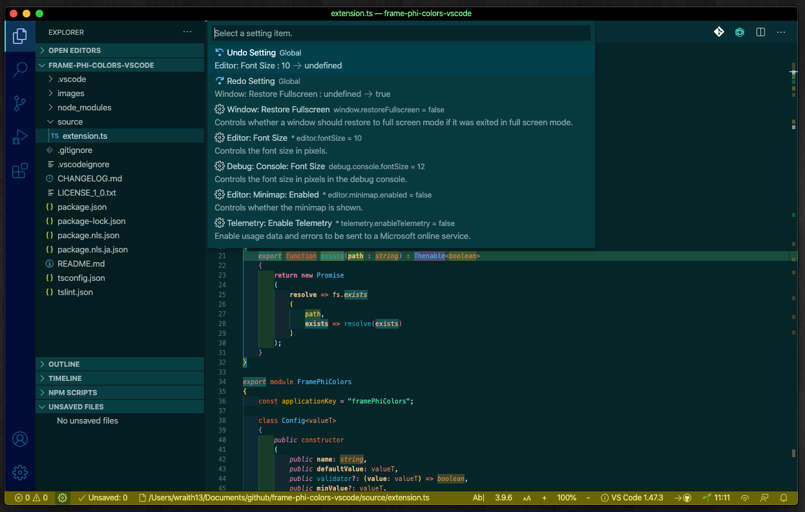
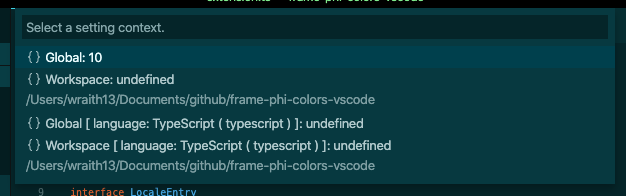
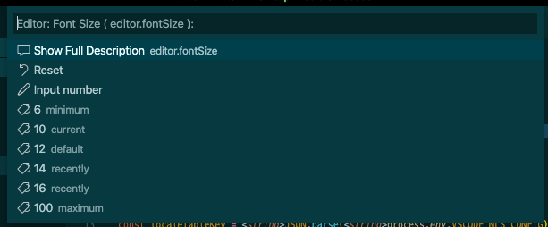

# Blitz for VS Code

Provide a quick and comfortable way to change settings by quick pick based UI.

## Features

VS Code provides two setting methods: a user-friendly GUI-based setting panel and direct editing of settings.json. Both are great, but they aren't suitable for everyday small configuration changes. This Blitz for VS Code provides a quick and comfortable way to change settings by quick pick based UI.

- Quick pick based setting
- Setting preview
- Setting undo/redo
- Reuse recently setting values

### Screenshots

Select a setting item.

Select a setting target. ( You can check the settings for each target at once. )

Select a value or input a value.

## Tutorial

### 0. ⬇️ Install Blitz

Show extension side bar within VS Code(Mac:`Command`+`Shift`+`X`, Windows and Linux: `Ctrl`+`Shift`+`X`), type `blitz` and press `Enter` and click `Install`.

### 1. 🚀 Edit settings

Launch Command Palette, Execute `Blitz: Edit Settings` command or click gear icon on status bar or keyboard shortcut ( Mac:`Command`+`Shift`+`,`, Windows and Linux: `Ctrl`+`Shift`+`,` ). You can edit VS Code settings.

### 2. 🔧 Next step

You can change [settings](#extension-settings). And you can edit [keyboard shortcuts](#keyboard-shortcut-settings) by `keybindings.json`.

Enjoy!

## Commands

* `Blitz: Edit Settings` : Edit VS Code's settings.
* `Blitz: Undo Setting` : Undo VS Code's settings.
* `Blitz: Redo Setting` : Redo VS Code's settings.
* `Blitz: Clear Setting History` : Clear recently information. This command can only be used in debug mode.

## Extension Settings

This extension contributes the following settings by [`settings.json`](https://code.visualstudio.com/docs/customization/userandworkspace#_creating-user-and-workspace-settings)( Mac: `Command`+`,`, Windows / Linux: `File` -> `Preferences` -> `User Settings` ):

* `blitz.preview`: Temporarily apply the settings before confirming.
* `blitz.debug`: Debug mode.
* `blitz.statusBarAlignment`: Alignment on status bar.
* `blitz.statusBarText`: Status bar's label.

## Keyboard shortcut Settings

You can edit keyboard shortcuts by [`keybindings.json`](https://code.visualstudio.com/docs/customization/keybindings#_customizing-shortcuts)
( Mac: `Code` -> `Preferences` -> `Keyboard Shortcuts`, Windows / Linux: `File` -> `Preferences` -> `Keyboard Shortcuts`).

Command name on `keybindings.json` is diffarent from on Command Pallete. See below table.

|on Command Pallete|on keybindings.json|default Keyboard shortcut|
|-|-|-|
|`Blitz: Edit Settings`|`blitz.editSettings`|Mac:`Command`+`Shift`+`,`, Windows and Linux: `Ctrl`+`Shift`+`,`|
|`Blitz: Undo Setting`|`blitz.undoSetting`|(none)|
|`Blitz: Redo Setting`|`blitz.redoSetting`|(none)|
|`Blitz: Clear Setting History`|`blitz.clearHistory`|(none)|

## Release Notes

see ChangLog on [marketplace](https://marketplace.visualstudio.com/items/wraith13.blitz/changelog) or [github](https://github.com/wraith13/blitz-vscode/blob/master/CHANGELOG.md)

## Support

[GitHub Issues](https://github.com/wraith13/blitz-vscode/issues)

## License

[Boost Software License](https://github.com/wraith13/blitz-vscode/blob/master/LICENSE_1_0.txt)

## Other extensions of wraith13's work

|Icon|Name|Description|
|---|---|---|
| |[Background Phi Colors](https://marketplace.visualstudio.com/items?itemName=wraith13.background-phi-colors)|This extension colors the background in various ways.|
| |[Zoom Bar](https://marketplace.visualstudio.com/items?itemName=wraith13.zoombar-vscode)|Zoom UI in status bar for VS Code.|
| |[Unsaved Files](https://marketplace.visualstudio.com/items?itemName=wraith13.unsaved-files-vscode)|Easy access to unsaved files for VS Code.|

See all wraith13's  expansions: <https://marketplace.visualstudio.com/publishers/wraith13>
